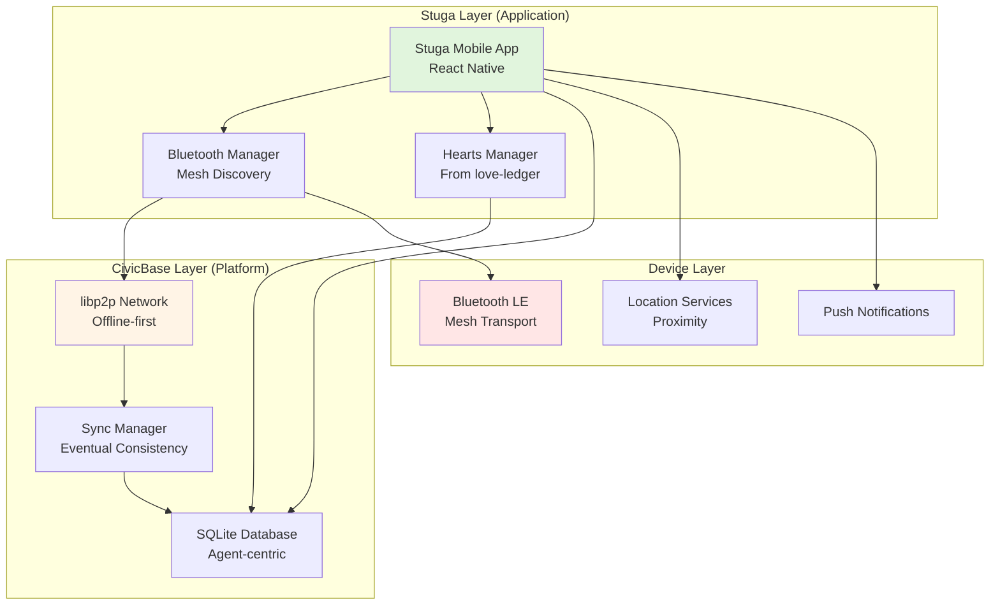

# Stuga Technical Specification
## Neighborhood Crisis Coordination Platform

**Status:** Planning / Early Development  
**Version:** 0.1  
**Last Updated:** 2025-12-27  
**Target Pilot:** Upplands Väsby kommun + Civilförsvarsförbundet Väsby  
**Platform:** Built on CivicBase infrastructure

---

## 0. Executive Summary

Stuga is a **crisis-focused neighborhood coordination application** built on the CivicBase P2P platform. Unlike love-ledger's comprehensive care economy system, Stuga has a laser-focused mission: enable Swedish neighbors to coordinate resources and mutual aid during crises when internet infrastructure fails.

**Core Innovation:** Bluetooth mesh networking for true offline operation during the critical first 72 hours of a crisis, when centralized systems fail but community resilience determines survival.

**Design Philosophy:** Brutal minimalism. Every feature must answer: "Does this help neighbors share resources when the internet is down?"

---

## 1. System Architecture

### 1.1 Architecture Overview



### 1.2 Technology Stack

| Layer | Technology | Rationale | Source |
|-------|-----------|-----------|--------|
| **Mobile App** | React Native | Cross-platform (iOS/Android), one codebase | New (Stuga-specific) |
| **UI Framework** | React Native Paper | Material Design, accessibility built-in | New |
| **P2P Infrastructure** | libp2p (via CivicBase) | Proven offline-first, mesh-capable | CivicBase |
| **Local Database** | SQLite (via CivicBase) | Agent-centric, offline-capable | CivicBase |
| **Sync Protocol** | Vector clocks + LWW (via CivicBase) | Conflict resolution without central authority | CivicBase |
| **Bluetooth** | react-native-ble-plx | Mesh networking when internet fails | New |
| **Location** | react-native-geolocation | Proximity detection (privacy-preserving) | New |
| **Hearts Logic** | From love-ledger | Mutual aid tracking, simplified | Adapted from love-ledger |
| **Auth** | BankID (via CivicBase) | Swedish national identity, sybil protection | CivicBase |
| **Push** | Firebase Cloud Messaging | Notifications when online | New |

**Key Differences from love-ledger:**

| Feature | love-ledger | Stuga |
|---------|-------------|-------|
| **Blockchain** | Holochain (complex) | CivicBase libp2p (simpler) |
| **Backend** | PostgreSQL + Redis | SQLite only (via CivicBase) |
| **Fiat Integration** | Swish AUBI distribution | None (Hearts only) |
| **Validation** | Community Weavers (formal) | Peer validation (informal) |
| **Leaves NFTs** | Yes (ecological) | No (crisis-focused) |
| **LMCI Dashboard** | Yes (complex metrics) | No (simple resource tracking) |

### 1.3 Deployment Architecture

**MVP (Months 1-6):**
```
User's Phone (iOS/Android)
├── Stuga App (React Native)
├── CivicBase SDK (libp2p + SQLite)
└── Bluetooth Stack (Native)

Internet Available:
- App ↔ CivicBase Platform (sync)
- User ↔ User (via internet if available)

Internet Down:
- User ↔ User (Bluetooth mesh)
- All data local (SQLite)
- Sync when reconnection
```

**No Backend Server Required** (for offline operation)  
**Optional Backend** (for online features):
- Push notifications relay
- Optional centralized user directory
- Metrics collection (opt-in)

---

## 2. Core Data Model

### 2.1 Entities

**Much Simpler than love-ledger** (no complex validation, no AUBI, no Leaves)

#### User (Neighbor)
```typescript
interface User {
  id: string;                    // UUID
  name: string;                  // From BankID
  bankid_verified: boolean;      // Sybil protection
  location: {
    lat: number;
    lon: number;
    accuracy: number;            // Privacy: rounded to ~50m
  };
  
  // Stuga-specific
  resources_offered: ResourceType[];
  resources_needed: ResourceType[];
  hearts_balance: number;
  availability_status: 'available' | 'away' | 'emergency';
  
  // Mesh networking
  bluetooth_id: string;           // BLE identifier
  last_seen: timestamp;
  mesh_hop_count: number;         // How far via mesh
  
  // Privacy
  share_exact_location: boolean;  // Default: false
  visible_to_neighbors: boolean;  // Default: true
}
```

#### Resource
```typescript
type ResourceCategory = 
  | 'mat' | 'värme' | 'verktyg' | 'transport' 
  | 'kunskap' | 'boende' | 'första_hjälpen' | 'annat';

interface Resource {
  id: string;
  user_id: string;
  type: 'offer' | 'need';
  category: ResourceCategory;
  title: string;                  // "Generator, 5kW"
  description: string;            // "Kan dela med 2-3 familjer"
  
  // Matching
  status: 'open' | 'matched' | 'completed' | 'cancelled';
  matched_with_user: string | null;
  
  // Hearts
  hearts_value: number | null;    // Set when completed
  
  // Offline sync
  created_offline: boolean;
  synced: boolean;
  last_modified: timestamp;
}
```

#### Hearts Transaction
```typescript
interface HeartsTransaction {
  id: string;
  from_user: string;
  to_user: string;
  amount: number;
  
  reason: string;                 // "Delade ved under snöstorm"
  related_resource: string | null; // Link to Resource
  
  // Validation (simplified from love-ledger)
  confirmed_by_sender: boolean;
  confirmed_by_receiver: boolean;
  
  // Offline
  created_offline: boolean;
  synced: boolean;
  timestamp: timestamp;
}
```

#### Mesh Node (Bluetooth Discovery)
```typescript
interface MeshNode {
  bluetooth_id: string;
  user_id: string;
  signal_strength: number;        // RSSI
  distance_estimate: number;      // Meters (approximate)
  last_seen: timestamp;
  hop_count: number;              // 0 = direct, 1+ = via mesh
  route: string[];                // Path of bluetooth_ids
}
```

### 2.2 Database Schema (SQLite via CivicBase)

**Tables:**

```sql
-- Users (neighbors)
CREATE TABLE users (
  id TEXT PRIMARY KEY,
  name TEXT NOT NULL,
  bankid_verified INTEGER DEFAULT 0,
  location_lat REAL,
  location_lon REAL,
  hearts_balance REAL DEFAULT 0,
  availability_status TEXT DEFAULT 'available',
  bluetooth_id TEXT UNIQUE,
  last_seen INTEGER,
  created_at INTEGER,
  updated_at INTEGER
);

-- Resources (offers/needs)
CREATE TABLE resources (
  id TEXT PRIMARY KEY,
  user_id TEXT NOT NULL,
  type TEXT NOT NULL CHECK(type IN ('offer', 'need')),
  category TEXT NOT NULL,
  title TEXT NOT NULL,
  description TEXT,
  status TEXT DEFAULT 'open',
  matched_with_user TEXT,
  hearts_value REAL,
  created_offline INTEGER DEFAULT 0,
  synced INTEGER DEFAULT 0,
  created_at INTEGER,
  updated_at INTEGER,
  FOREIGN KEY (user_id) REFERENCES users(id)
);

-- Hearts transactions
CREATE TABLE hearts_transactions (
  id TEXT PRIMARY KEY,
  from_user TEXT NOT NULL,
  to_user TEXT NOT NULL,
  amount REAL NOT NULL,
  reason TEXT,
  related_resource TEXT,
  confirmed_by_sender INTEGER DEFAULT 1,
  confirmed_by_receiver INTEGER DEFAULT 0,
  created_offline INTEGER DEFAULT 0,
  synced INTEGER DEFAULT 0,
  created_at INTEGER,
  FOREIGN KEY (from_user) REFERENCES users(id),
  FOREIGN KEY (to_user) REFERENCES users(id),
  FOREIGN KEY (related_resource) REFERENCES resources(id)
);

-- Mesh nodes (Bluetooth discovery)
CREATE TABLE mesh_nodes (
  bluetooth_id TEXT PRIMARY KEY,
  user_id TEXT,
  signal_strength INTEGER,
  distance_estimate REAL,
  hop_count INTEGER DEFAULT 0,
  last_seen INTEGER,
  FOREIGN KEY (user_id) REFERENCES users(id)
);
```

**Indexes:**
```sql
CREATE INDEX idx_resources_user ON resources(user_id);
CREATE INDEX idx_resources_status ON resources(status);
CREATE INDEX idx_hearts_from ON hearts_transactions(from_user);
CREATE INDEX idx_hearts_to ON hearts_transactions(to_user);
CREATE INDEX idx_mesh_user ON mesh_nodes(user_id);
CREATE INDEX idx_mesh_lastseen ON mesh_nodes(last_seen);
```

---

## 3. Offline Capability (Critical Feature)

### 3.1 Bluetooth Mesh Networking

**Problem:** Internet is down. How do neighbors 500m apart communicate?

**Solution:** Multi-hop Bluetooth mesh

```typescript
// Bluetooth mesh discovery
class BluetoothMeshManager {
  private discovered_nodes: Map<string, MeshNode> = new Map();
  
  async startDiscovery() {
    // Advertise self
    await BLE.startAdvertising({
      name: `stuga-${user.bluetooth_id}`,
      services: ['stuga-mesh'],
      data: {
        user_id: user.id,
        location_hash: anonymizeLocation(user.location), // Privacy
        has_resources: user.resources_offered.length > 0
      }
    });
    
    // Scan for others
    await BLE.scan({
      services: ['stuga-mesh'],
      onDiscover: (device) => this.handleNodeDiscovered(device),
      allowDuplicates: true // Update signal strength
    });
  }
  
  handleNodeDiscovered(device: BLEDevice) {
    const node: MeshNode = {
      bluetooth_id: device.id,
      user_id: device.data.user_id,
      signal_strength: device.rssi,
      distance_estimate: rssiToDistance(device.rssi),
      hop_count: 0, // Direct connection
      last_seen: Date.now()
    };
    
    this.discovered_nodes.set(device.id, node);
    
    // If device is >100m away, request multi-hop route
    if (node.distance_estimate > 100) {
      this.requestMeshRoute(device.id);
    }
  }
  
  async requestMeshRoute(target_id: string) {
    // Find intermediate nodes
    const intermediate_nodes = Array.from(this.discovered_nodes.values())
      .filter(n => n.distance_estimate < 100)
      .sort((a, b) => a.distance_estimate - b.distance_estimate);
    
    // Request route via closest node
    if (intermediate_nodes.length > 0) {
      await this.sendMeshMessage(intermediate_nodes[0].bluetooth_id, {
        type: 'route_request',
        target: target_id,
        path: [this.self_bluetooth_id]
      });
    }
  }
}
```

### 3.2 Offline Sync Protocol

**Scenario:** Internet down for 72 hours

**Hour 0-24:**
- All operations local (SQLite)
- Bluetooth mesh for neighbor communication
- Optimistic UI (assume success)

**Hour 24-48:**
- Mesh gossip: nodes share updates
- Conflict detection (vector clocks)
- Peer-to-peer sync when in range

**Hour 48-72:**
- System continues functioning
- More stale data (acceptable tradeoff)
- Hearts transactions pending confirmation

**Internet returns:**
- Automatic sync to CivicBase platform
- Conflict resolution (last-write-wins for crisis data)
- Hearts validation (peer confirmations checked)

```typescript
class OfflineSyncManager {
  async syncToMeshPeer(peer_id: string) {
    // Get unsynced data
    const pending_resources = await db.query(
      'SELECT * FROM resources WHERE synced = 0 AND created_at > ?',
      [peer_last_sync_time]
    );
    
    const pending_hearts = await db.query(
      'SELECT * FROM hearts_transactions WHERE synced = 0'
    );
    
    // Send via Bluetooth
    await bluetooth.send(peer_id, {
      type: 'sync_data',
      resources: pending_resources,
      hearts: pending_hearts,
      vector_clock: this.getVectorClock()
    });
  }
  
  async handleSyncData(data: SyncMessage) {
    // Merge resources
    for (const resource of data.resources) {
      const existing = await db.getResource(resource.id);
      
      if (!existing) {
        await db.insertResource(resource);
      } else {
        // Conflict resolution
        if (compareVectorClocks(data.vector_clock, this.local_clock) > 0) {
          await db.updateResource(resource);
        }
      }
    }
    
    // Merge Hearts (require confirmation)
    for (const tx of data.hearts) {
      await db.insertHearts(tx); // Will be validated when internet returns
    }
  }
}
```

---

## 4. Hearts Integration (Simplified from love-ledger)

### 4.1 Hearts Logic

**Difference from love-ledger:**

| Feature | love-ledger | Stuga |
|---------|-------------|-------|
| **Issuance** | AUBI (monthly) | Manual (per transaction) |
| **Demurrage** | 0.5%/month | None (crisis context) |
| **Fiat conversion** | Swish redemption | None (MVP) |
| **Validation** | Community Weaver | Peer confirmation |
| **Scope** | Bioregional care economy | Neighborhood crisis aid |

**Hearts Creation:**
```typescript
async function createHeartsTransaction(
  from_user: string,
  to_user: string,
  amount: number,
  reason: string,
  resource_id?: string
): Promise<HeartsTransaction> {
  
  // Validation
  const from_balance = await db.getUserHeartsBalance(from_user);
  if (from_balance < amount) {
    throw new Error('Insufficient Hearts balance');
  }
  
  // Create transaction
  const tx: HeartsTransaction = {
    id: uuid(),
    from_user,
    to_user,
    amount,
    reason,
    related_resource: resource_id || null,
    confirmed_by_sender: true,
    confirmed_by_receiver: false, // Awaiting confirmation
    created_offline: !isOnline(),
    synced: false,
    timestamp: Date.now()
  };
  
  // Save locally
  await db.insertHeartsTransaction(tx);
  
  // Update balances (optimistic)
  await db.updateUserBalance(from_user, from_balance - amount);
  await db.updateUserBalance(to_user, 
    (await db.getUserHeartsBalance(to_user)) + amount
  );
  
  // Notify receiver (if online or via mesh)
  if (isOnline()) {
    await pushNotification(to_user, `You received ${amount} Hearts from ${from_user.name}`);
  } else {
    await bluetoothMesh.sendMessage(to_user, {
      type: 'hearts_received',
      transaction: tx
    });
  }
  
  return tx;
}
```

**Peer Confirmation:**
```typescript
async function confirmHeartsTransaction(
  transaction_id: string,
  user_id: string
): Promise<void> {
  const tx = await db.getHeartsTransaction(transaction_id);
  
  if (tx.to_user !== user_id) {
    throw new Error('Only receiver can confirm');
  }
  
  tx.confirmed_by_receiver = true;
  tx.synced = false; // Mark for re-sync with confirmation
  
  await db.updateHeartsTransaction(tx);
  
  // Notify sender
  if (isOnline()) {
    await pushNotification(tx.from_user, `${user_id.name} confirmed your Hearts transaction`);
  }
}
```

### 4.2 Initial Hearts Distribution

**Problem:** New users need Hearts to participate

**Solutions (choose one for MVP):**

**Option A: Free Hearts on Signup** (Simplest)
```typescript
async function onboardNewUser(user: User) {
  await db.insertHeartsTransaction({
    id: uuid(),
    from_user: 'system',
    to_user: user.id,
    amount: 100,
    reason: 'Välkommen till Stuga! (Welcome to Stuga!)',
    confirmed_by_sender: true,
    confirmed_by_receiver: true,
    created_offline: false,
    synced: true,
    timestamp: Date.now()
  });
}
```

**Option B: Earn Through Onboarding** (Better incentives)
```typescript
async function onboardNewUser(user: User) {
  const tasks = [
    { task: 'Complete profile', hearts: 20 },
    { task: 'Add first resource offer', hearts: 30 },
    { task: 'Send first Hearts transaction', hearts: 50 }
  ];
  
  // Award Hearts for completing onboarding steps
  for (const task of tasks) {
    if (await checkTaskCompleted(user.id, task.task)) {
      await awardHearts(user.id, task.hearts, task.task);
    }
  }
}
```

---

## 5. Core Features (MVP)

### 5.1 Feature Priority

**Must-Have (MVP Launch):**
- ✅ Bluetooth mesh discovery (offline capability)
- ✅ Resource posting (offer/need)
- ✅ Simple resource matching
- ✅ Hearts transactions (basic)
- ✅ Offline operation (72+ hours)
- ✅ BankID onboarding (sybil protection)

**Should-Have (Month 2-3):**
- 🔄 Push notifications (when online)
- 🔄 Resource search/filter
- 🔄 Hearts confirmation workflow
- 🔄 User profiles (view neighbors)

**Could-Have (Month 4-6):**
- ⏳ In-app messaging
- ⏳ Resource history/archive
- ⏳ Hearts leaderboard (gamification)
- ⏳ FRG integration

**Won't-Have (MVP):**
- ❌ Fiat integration (no Swish/AUBI)
- ❌ Leaves NFTs
- ❌ Community Weaver validation
- ❌ LMCI dashboard
- ❌ Cross-BAZ federation
- ❌ IoT integration

### 5.2 Resource Matching Algorithm

**Simple proximity + category matching:**

```typescript
async function findMatches(resource: Resource): Promise<Match[]> {
  const user_location = await db.getUserLocation(resource.user_id);
  
  const opposite_type = resource.type === 'offer' ? 'need' : 'offer';
  
  const potential_matches = await db.query(`
    SELECT r.*, u.location_lat, u.location_lon, u.hearts_balance
    FROM resources r
    JOIN users u ON r.user_id = u.id
    WHERE r.type = ?
      AND r.category = ?
      AND r.status = 'open'
      AND r.user_id != ?
  `, [opposite_type, resource.category, resource.user_id]);
  
  // Calculate distance and sort
  const matches = potential_matches.map(match => {
    const distance = calculateDistance(
      user_location.lat, user_location.lon,
      match.location_lat, match.location_lon
    );
    
    return {
      resource: match,
      distance,
      priority: calculatePriority(match, distance)
    };
  })
  .filter(m => m.distance < 5000) // 5km max
  .sort((a, b) => a.priority - b.priority);
  
  return matches;
}

function calculatePriority(resource: Resource, distance: number): number {
  let priority = distance; // Closer = better
  
  // Boost if high-value contributor (has Hearts)
  if (resource.user.hearts_balance > 100) {
    priority *= 0.8;
  }
  
  // Penalize if far via mesh
  if (resource.user.mesh_hop_count > 2) {
    priority *= 1.5;
  }
  
  return priority;
}
```

---

## 6. Security & Privacy

### 6.1 Threat Model

**Threats specific to crisis context:**

1. **Sybil Attacks** (fake neighbors)
   - **Mitigation:** BankID verification required
   - **Impact:** Max 1 account per person

2. **Location Tracking** (privacy invasion)
   - **Mitigation:** Location rounded to ~50m, optional exact sharing
   - **Impact:** Can't pinpoint exact address from app

3. **Hearts Gaming** (fake transactions)
   - **Mitigation:** Peer confirmation required, mesh gossip validates
   - **Impact:** Difficult to fake without collusion

4. **Resource Hoarding** (no sharing)
   - **Mitigation:** Community social pressure, visible Hearts balance
   - **Impact:** Self-policing community

5. **Bluetooth Spoofing** (fake mesh nodes)
   - **Mitigation:** Signed messages, BLE encryption
   - **Impact:** Can't impersonate users

### 6.2 Privacy Design

**What we track:**
- Approximate location (500m radius)
- Resources offered/needed
- Hearts balance (visible to all neighbors)
- Transaction history (only between parties)

**What we DON'T track:**
- Exact home address
- Real-time GPS movements
- Private messages content (if feature added)
- Browsing behavior
- Social graph beyond immediate neighbors

**GDPR Compliance:**
- Agent-centric data (SQLite on device)
- Right to be forgotten (delete app = delete data)
- Data minimization (only what's needed)
- Consent-based sharing

---

## 7. Development Roadmap

### 7.1 Phase 1: MVP (Months 1-3)

**Month 1: Core Infrastructure**
- [ ] React Native app skeleton
- [ ] CivicBase SDK integration
- [ ] SQLite database setup
- [ ] BankID authentication flow

**Month 2: Offline Capability**
- [ ] Bluetooth mesh discovery
- [ ] Offline resource posting
- [ ] Hearts transactions (basic)
- [ ] Sync protocol implementation

**Month 3: UI Polish + Testing**
- [ ] Resource matching UI
- [ ] Hearts transaction UI
- [ ] Neighbor map view
- [ ] 72-hour offline test

**Deliverables:**
- Working iOS/Android app
- Offline operation validated
- 20-30 pilot users in Väsby

### 7.2 Phase 2: Pilot Expansion (Months 4-6)

**Month 4: Features**
- [ ] Push notifications
- [ ] Resource search/filter
- [ ] User profiles
- [ ] Hearts confirmation workflow

**Month 5: FRG Integration**
- [ ] Civilförsvarsförbundet pilot
- [ ] Bulk onboarding tools
- [ ] Group coordination features
- [ ] Exercise mode (simulation)

**Month 6: Scale**
- [ ] 100+ users
- [ ] Multi-neighborhood coverage
- [ ] Performance optimization
- [ ] Metrics dashboard

**Deliverables:**
- 100+ active users
- FRG integration validated
- Proven offline capability

### 7.3 Success Metrics

| Metric | MVP Target | Pilot Target |
|--------|-----------|--------------|
| **Active users** | 30 | 100 |
| **Offline uptime** | 72 hours | 168 hours (1 week) |
| **Resource posts** | 50 | 500 |
| **Successful matches** | 10 | 100 |
| **Hearts transactions** | 30 | 300 |
| **Mesh range** | 500m | 2km |
| **User satisfaction** | 70% | 80% |

---

## 8. Integration with CivicBase

**What we get from CivicBase:**

✅ libp2p P2P networking  
✅ SQLite agent-centric database  
✅ Offline sync protocol (vector clocks)  
✅ End-to-end encryption (AES-256-GCM)  
✅ BankID authentication integration  
✅ Conflict resolution logic  

**What Stuga adds:**

🆕 React Native mobile UI  
🆕 Bluetooth mesh networking  
🆕 Resource matching logic  
🆕 Hearts transaction UI  
🆕 Proximity-based discovery  
🆕 Swedish crisis context  

**Integration architecture:**

```typescript
// Stuga imports CivicBase SDK
import { CivicBaseClient } from '@civicbase/sdk';

const civicbase = new CivicBaseClient({
  network: 'stuga-vasby',
  storage: 'sqlite',
  offline_capable: true,
  encryption: true
});

// Use CivicBase for persistence
await civicbase.db.insert('resources', resource);

// Use CivicBase for sync
await civicbase.sync.toMesh(bluetooth_peers);

// Use CivicBase for crypto
const encrypted = await civicbase.crypto.encrypt(message, recipient_key);
```

---

## 9. Open Questions

1. **Hearts Initial Distribution:** Free 100 Hearts on signup, or earn through tasks?

2. **Mesh Range:** Should we support multi-hop mesh (complex but extends range) or direct Bluetooth only (simple but limited to 50m)?

3. **Resource Matching:** Automated matching or manual browsing? Automated is faster but less human.

4. **FRG Integration:** Should FRG coordinators have admin privileges, or keep all users equal?

5. **Privacy vs. Discovery:** How much location precision to reveal? 500m radius feels safe but might be too vague.

6. **Offline Hearts Validity:** Should Hearts created offline be "provisional" until online validation, or trusted immediately?

---

## 10. Appendices

### A. Glossary

| Term | Definition |
|------|------------|
| **Stuga** | Swedish for "cottage" - symbolizes neighborhood as shelter during crisis |
| **Hearts** | Mutual aid currency tracking favors, borrowed from love-ledger |
| **Mesh** | Multi-hop Bluetooth network where devices relay messages |
| **Agent-centric** | Each user owns their data, no central database |
| **Vector clocks** | Distributed timestamp mechanism for conflict resolution |
| **FRG** | Frivilliga resursgrupper (Volunteer resource groups) in Swedish civil defense |
| **MCF** | Myndigheten för civilt försvar (Civil Defense Agency) |

### B. File Structure

```
Stuga/
├── mobile/
│   ├── src/
│   │   ├── screens/
│   │   │   ├── HomeScreen.tsx
│   │   │   ├── ResourcesScreen.tsx
│   │   │   ├── HeartsScreen.tsx
│   │   │   └── NeighborMapScreen.tsx
│   │   ├── components/
│   │   │   ├── ResourceCard.tsx
│   │   │   ├── HeartsSend.tsx
│   │   │   └── BluetoothDiscovery.tsx
│   │   ├── services/
│   │   │   ├── bluetooth.ts
│   │   │   ├── hearts.ts
│   │   │   └── civicbase.ts
│   │   └── App.tsx
│   ├── ios/
│   ├── android/
│   └── package.json
├── docs/
│   ├── TECHNICAL_SPECIFICATION.md (this file)
│   └── UI_SPECIFICATION.md
└── README.md
```

### C. References

- **CivicBase Platform:** https://github.com/GlobalGovernanceFrameworks/CivicBase
- **love-ledger (Hearts origin):** https://github.com/GlobalGovernanceFrameworks/love-ledger
- **React Native Docs:** https://reactnative.dev
- **libp2p Docs:** https://docs.libp2p.io
- **BLE Mesh Networking:** https://www.bluetooth.com/specifications/mesh-specifications/
- **MCF Totalförsvar 2024:** https://www.msb.se/sv/amnesomraden/krisberedskap-och-civilt-forsvar/

---

**END OF TECHNICAL SPECIFICATION**

*This specification defines the Minimum Viable Product (MVP) for Stuga, a crisis-focused neighborhood coordination app built on CivicBase infrastructure. Unlike love-ledger's comprehensive care economy system, Stuga is ruthlessly scoped for one mission: offline resource coordination during the critical first 72 hours of a crisis.*

*Next steps: Mobile development sprint planning, Väsby pilot recruitment, Civilförsvarsförbundet partnership formalization.*
