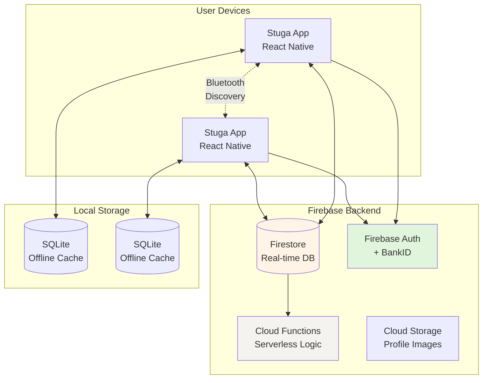
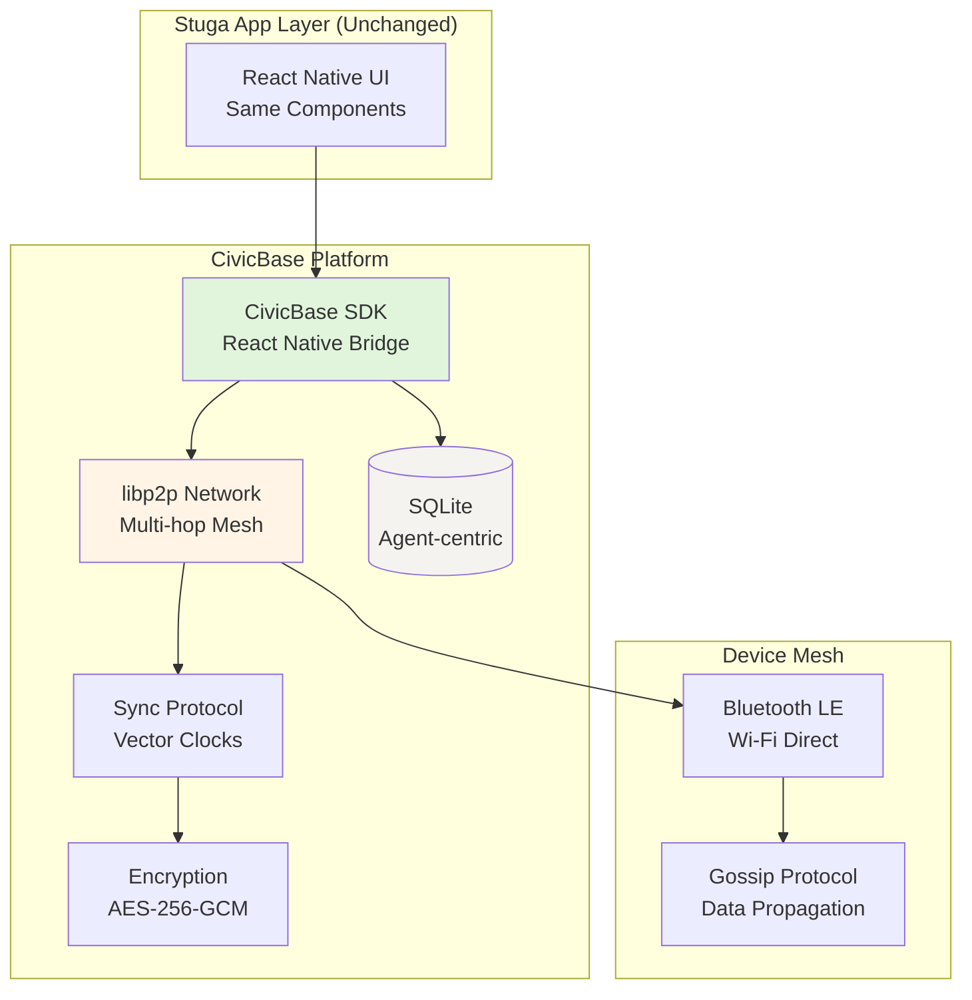

# Stuga Technical Specification
## Two-Phase Development: Firebase MVP → CivicBase Production

**Status:** Planning / Early Development  
**Version:** 2.0 (Revised for Firebase MVP approach)  
**Last Updated:** 2025-12-27  
**Target Pilot:** Upplands Väsby kommun + Civilförsvarsförbundet Väsby  
**Development Approach:** AI-assisted (Claude/Gemini for implementation)

---

## 0. Executive Summary

Stuga is a **crisis-focused neighborhood coordination application** for Swedish municipalities. This specification covers **two development phases**:

**Phase 1 (MVP - Jan-Jun 2026):** Firebase-based prototype to validate concept with Upplands Väsby pilot  
**Phase 2 (Production - Aug 2026-2027):** Migration to CivicBase P2P platform for production deployment

### Why Two Phases?

**Timeline constraint:**
- Väsby pilot needed: April 2026
- CivicBase production ready: August 2026+ (requires expert consultant)
- Gap: 4 months

**Solution:**
- Build working MVP with proven stack (Firebase)
- Validate concept with real users
- Migrate to sovereign P2P infrastructure when ready

**This is not "settling" - it's smart sequencing.** Pilot validates requirements, informs CivicBase architecture.

---

## 1. Phase 1: MVP Architecture (Firebase-Based)

### 1.1 Technology Stack

| Layer | Technology | Rationale | Timeline |
|-------|-----------|-----------|----------|
| **Frontend** | React Native (Expo) | Cross-platform, fast development, AI-friendly | Week 1-2 |
| **Backend** | Firebase Firestore | Real-time sync, offline support built-in | Week 2-3 |
| **Auth** | Firebase Auth + BankID | Swedish identity verification | Week 3 |
| **Local DB** | SQLite (expo-sqlite) | Offline cache, large data storage | Week 4 |
| **Bluetooth** | react-native-ble-plx | Neighbor discovery (basic) | Week 5-6 |
| **Functions** | Firebase Cloud Functions | Serverless backend logic | Week 4-5 |
| **Storage** | Firebase Storage | Profile images (optional) | Week 6 |
| **Analytics** | Firebase Analytics | User behavior tracking | Week 7 |

**Total development time:** 8-10 weeks to pilot-ready

**Why Firebase?**
- ✅ AI assistants (Claude, Gemini) excel at React Native + Firebase
- ✅ Offline support built-in (Firestore offline persistence)
- ✅ BankID integration available (community libraries)
- ✅ Free for pilot scale (<50 users, <1GB data)
- ✅ 2-3 month timeline realistic (vs. 12 months for CivicBase)

**Acknowledged trade-offs:**
- ⚠️ Not true P2P mesh (delayed sync to central server)
- ⚠️ Data on Google servers (not sovereign)
- ⚠️ Requires eventual internet connection
- ⚠️ Limited Bluetooth (direct connections only, no multi-hop)

**Why acceptable:**
- Pilot goal: Validate concept, gather requirements
- Most Swedish apps use cloud services (SEB, Swish, etc.)
- Will migrate to sovereign CivicBase later
- Honest with users about limitations

### 1.2 Architecture Diagram (MVP)



### 1.3 Firebase Firestore Schema

**Collections:**

```javascript
// users collection
{
  id: string (auto),
  user_id: string (BankID),
  name: string,
  bankid_verified: boolean,
  created_at: timestamp,
  location: {
    lat: number,
    lon: number,
    accuracy: number, // Privacy: rounded to ~50m
    updated_at: timestamp
  },
  hearts_balance: number (default: 100),
  availability_status: 'available' | 'away' | 'emergency',
  profile_image_url: string (optional),
  bluetooth_id: string (for mesh discovery),
  fcm_token: string (for push notifications)
}

// resources collection
{
  id: string (auto),
  user_id: string (ref to users),
  type: 'offer' | 'need',
  category: 'mat' | 'värme' | 'verktyg' | 'transport' | 'kunskap' | 'boende' | 'första_hjälpen' | 'annat',
  title: string (max 100 chars),
  description: string (max 500 chars),
  status: 'open' | 'matched' | 'completed' | 'cancelled',
  matched_with_user: string (ref to users) | null,
  hearts_value: number | null,
  created_at: timestamp,
  updated_at: timestamp,
  expires_at: timestamp (optional, auto-cleanup)
}

// hearts_transactions collection
{
  id: string (auto),
  from_user: string (ref to users),
  to_user: string (ref to users),
  amount: number,
  reason: string,
  related_resource: string (ref to resources) | null,
  confirmed_by_sender: boolean (default: true),
  confirmed_by_receiver: boolean (default: false),
  created_at: timestamp,
  completed_at: timestamp | null
}

// mesh_nodes collection (for Bluetooth discovery)
{
  id: string (auto),
  bluetooth_id: string (unique),
  user_id: string (ref to users),
  signal_strength: number (RSSI),
  distance_estimate: number (meters, approximate),
  last_seen: timestamp,
  device_info: {
    platform: 'ios' | 'android',
    app_version: string
  }
}
```

**Firestore Security Rules:**

```javascript
rules_version = '2';
service cloud.firestore {
  match /databases/{database}/documents {
    
    // Users can read all users (for neighbor map)
    // but only update their own profile
    match /users/{userId} {
      allow read: if request.auth != null;
      allow create: if request.auth.uid == userId;
      allow update: if request.auth.uid == userId;
      allow delete: if request.auth.uid == userId;
    }
    
    // Resources readable by all authenticated users
    // Only owner can create/update/delete
    match /resources/{resourceId} {
      allow read: if request.auth != null;
      allow create: if request.auth != null && 
                       request.resource.data.user_id == request.auth.uid;
      allow update: if request.auth.uid == resource.data.user_id;
      allow delete: if request.auth.uid == resource.data.user_id;
    }
    
    // Hearts transactions: both parties can read
    // Only sender can create (receiver confirms via update)
    match /hearts_transactions/{txId} {
      allow read: if request.auth.uid == resource.data.from_user ||
                     request.auth.uid == resource.data.to_user;
      allow create: if request.auth.uid == request.resource.data.from_user;
      allow update: if request.auth.uid == resource.data.to_user && 
                       request.resource.data.keys().hasOnly(['confirmed_by_receiver', 'completed_at']);
    }
    
    // Mesh nodes: public read for discovery
    match /mesh_nodes/{nodeId} {
      allow read: if request.auth != null;
      allow write: if request.auth.uid == request.resource.data.user_id;
    }
  }
}
```

### 1.4 Firebase Cloud Functions

**functions/index.js:**

```javascript
const functions = require('firebase-functions');
const admin = require('firebase-admin');
admin.initializeApp();

// Update user's Hearts balance when transaction confirmed
exports.updateHeartsBalance = functions.firestore
  .document('hearts_transactions/{txId}')
  .onUpdate(async (change, context) => {
    const before = change.before.data();
    const after = change.after.data();
    
    // Trigger when receiver confirms
    if (!before.confirmed_by_receiver && after.confirmed_by_receiver) {
      const batch = admin.firestore().batch();
      
      // Deduct from sender
      const senderRef = admin.firestore().doc(`users/${after.from_user}`);
      batch.update(senderRef, {
        hearts_balance: admin.firestore.FieldValue.increment(-after.amount)
      });
      
      // Add to receiver
      const receiverRef = admin.firestore().doc(`users/${after.to_user}`);
      batch.update(receiverRef, {
        hearts_balance: admin.firestore.FieldValue.increment(after.amount)
      });
      
      // Mark transaction complete
      const txRef = admin.firestore().doc(`hearts_transactions/${context.params.txId}`);
      batch.update(txRef, {
        completed_at: admin.firestore.FieldValue.serverTimestamp()
      });
      
      await batch.commit();
      
      // Send push notification to sender
      await sendNotification(
        after.from_user,
        'Hearts confirmed!',
        `${await getUserName(after.to_user)} confirmed your Hearts transaction.`
      );
    }
  });

// Send push notification when Hearts received
exports.notifyHeartsReceived = functions.firestore
  .document('hearts_transactions/{txId}')
  .onCreate(async (snapshot, context) => {
    const tx = snapshot.data();
    const senderName = await getUserName(tx.from_user);
    
    await sendNotification(
      tx.to_user,
      'Hearts received!',
      `${senderName} sent you ${tx.amount} Hearts${tx.reason ? ': ' + tx.reason : ''}`
    );
  });

// Cleanup old mesh nodes (not seen in 1 hour)
exports.cleanupMeshNodes = functions.pubsub
  .schedule('every 15 minutes')
  .onRun(async (context) => {
    const oneHourAgo = Date.now() - 60 * 60 * 1000;
    const snapshot = await admin.firestore()
      .collection('mesh_nodes')
      .where('last_seen', '<', oneHourAgo)
      .get();
    
    const batch = admin.firestore().batch();
    snapshot.docs.forEach(doc => batch.delete(doc.ref));
    await batch.commit();
  });

// Helper functions
async function getUserName(userId) {
  const doc = await admin.firestore().doc(`users/${userId}`).get();
  return doc.data()?.name || 'Someone';
}

async function sendNotification(userId, title, body) {
  const userDoc = await admin.firestore().doc(`users/${userId}`).get();
  const fcmToken = userDoc.data()?.fcm_token;
  
  if (fcmToken) {
    await admin.messaging().send({
      token: fcmToken,
      notification: { title, body },
      data: { type: 'hearts_transaction' }
    });
  }
}
```

### 1.5 Offline Support Strategy

**Firestore Offline Persistence:**

```javascript
// src/lib/firebase.ts
import { initializeApp } from 'firebase/app';
import { getFirestore, enableIndexedDbPersistence } from 'firebase/firestore';

const app = initializeApp(firebaseConfig);
const db = getFirestore(app);

// Enable offline persistence (10MB cache)
enableIndexedDbPersistence(db, {
  cacheSizeBytes: 10 * 1024 * 1024 // 10MB
}).catch((err) => {
  if (err.code === 'failed-precondition') {
    console.warn('Multiple tabs open, persistence enabled only in first tab');
  } else if (err.code === 'unimplemented') {
    console.warn('Browser doesn't support offline persistence');
  }
});
```

**SQLite for Larger Offline Storage:**

```javascript
// src/lib/database.ts
import * as SQLite from 'expo-sqlite';

const db = SQLite.openDatabase('stuga.db');

// Initialize tables
db.transaction(tx => {
  // Cache users for offline map
  tx.executeSql(`
    CREATE TABLE IF NOT EXISTS cached_users (
      id TEXT PRIMARY KEY,
      data TEXT NOT NULL,
      cached_at INTEGER NOT NULL
    )
  `);
  
  // Queue offline transactions
  tx.executeSql(`
    CREATE TABLE IF NOT EXISTS pending_transactions (
      id TEXT PRIMARY KEY,
      type TEXT NOT NULL,
      data TEXT NOT NULL,
      created_at INTEGER NOT NULL,
      synced INTEGER DEFAULT 0
    )
  `);
});

// Queue offline hearts transaction
export function queueOfflineTransaction(type: string, data: any) {
  return new Promise((resolve, reject) => {
    db.transaction(tx => {
      tx.executeSql(
        'INSERT INTO pending_transactions (id, type, data, created_at) VALUES (?, ?, ?, ?)',
        [uuid(), type, JSON.stringify(data), Date.now()],
        (_, result) => resolve(result),
        (_, error) => reject(error)
      );
    });
  });
}

// Sync queued transactions when online
export async function syncPendingTransactions(firestore: Firestore) {
  return new Promise((resolve, reject) => {
    db.transaction(tx => {
      tx.executeSql(
        'SELECT * FROM pending_transactions WHERE synced = 0',
        [],
        async (_, { rows }) => {
          for (let i = 0; i < rows.length; i++) {
            const item = rows.item(i);
            const data = JSON.parse(item.data);
            
            try {
              // Upload to Firestore
              if (item.type === 'hearts_transaction') {
                await addDoc(collection(firestore, 'hearts_transactions'), data);
              }
              // Mark synced
              tx.executeSql(
                'UPDATE pending_transactions SET synced = 1 WHERE id = ?',
                [item.id]
              );
            } catch (error) {
              console.error('Sync error:', error);
            }
          }
          resolve(true);
        },
        (_, error) => reject(error)
      );
    });
  });
}
```

### 1.6 Bluetooth Mesh (Basic)

**Using react-native-ble-plx for neighbor discovery:**

```javascript
// src/lib/bluetooth.ts
import { BleManager } from 'react-native-ble-plx';

const manager = new BleManager();

// Start advertising self
export async function startAdvertising(userId: string) {
  await manager.startDeviceScan(
    null, // All services
    { allowDuplicates: true },
    (error, device) => {
      if (error) {
        console.error('Scan error:', error);
        return;
      }
      
      // Detect other Stuga users
      if (device?.name?.startsWith('Stuga-')) {
        const neighborId = device.name.replace('Stuga-', '');
        const distance = rssiToDistance(device.rssi);
        
        // Update mesh_nodes in Firestore (when online)
        // Or cache locally (when offline)
        updateMeshNode({
          bluetooth_id: device.id,
          user_id: neighborId,
          signal_strength: device.rssi,
          distance_estimate: distance,
          last_seen: Date.now()
        });
      }
    }
  );
}

// Convert RSSI to approximate distance
function rssiToDistance(rssi: number): number {
  const txPower = -59; // Calibrated transmission power at 1m
  if (rssi === 0) return -1;
  
  const ratio = rssi / txPower;
  if (ratio < 1.0) {
    return Math.pow(ratio, 10);
  } else {
    return (0.89976) * Math.pow(ratio, 7.7095) + 0.111;
  }
}
```

**Limitations acknowledged:**
- Only direct Bluetooth connections (50m range)
- No multi-hop mesh relay
- Requires periodic internet sync for data propagation
- Good enough for MVP validation, not production scale

---

## 2. Phase 2: Production Architecture (CivicBase)

### 2.1 Migration Timeline

```
Q3 2026: CivicBase Core Ready
├─ Month 7 (Aug): Consultant starts, architecture review
├─ Month 8 (Sep): libp2p mesh networking
├─ Month 9 (Oct): Agent-centric database
└─ Month 10 (Nov): CivicBase SDK for React Native

Q4 2026: Migration Preparation
├─ Month 11 (Dec): Beta testing with 5-10 users
├─ Data migration scripts developed
├─ React Native integration layer
└─ Security audit

Q1 2027: Progressive Rollout
├─ Week 1-2: 10% users (monitor closely)
├─ Week 3-4: 25% users (gather feedback)
├─ Week 5-6: 50% users (optimize performance)
├─ Week 7-8: 100% users (complete migration)
└─ Firebase sunset
```

### 2.2 CivicBase Architecture



### 2.3 Migration Strategy

**Code changes (React Native layer):**

```javascript
// BEFORE (Firebase)
import { collection, addDoc } from 'firebase/firestore';
import { db } from '@/lib/firebase';

async function createResource(resource) {
  return await addDoc(collection(db, 'resources'), resource);
}

// AFTER (CivicBase)
import { CivicBase } from '@civicbase/sdk';
const civicbase = new CivicBase({ mesh: true });

async function createResource(resource) {
  return await civicbase.db.insert('resources', resource);
}
```

**API compatibility layer:**
- Create abstraction layer in MVP that mirrors CivicBase API
- Swap backend without changing UI code
- 90%+ of React Native code reusable

**Data migration:**
- Export from Firebase (JSON dump)
- Import to CivicBase via SDK
- Verify integrity (hash checks)
- Users see seamless transition

---

## 3. AI-Assisted Development Workflow

### 3.1 Development Process

**Human (Björn) responsibilities:**
- Define feature requirements
- Create UI/UX mockups (can be sketches)
- Test features on device
- Provide user feedback
- Make architectural decisions

**AI (Claude/Gemini) responsibilities:**
- Implement React Native components
- Write Firebase integration code
- Generate Firestore security rules
- Create Cloud Functions
- Write test cases

**Iteration loop:**
```
1. Björn: "I need a screen that shows neighbors within 500m"
2. Claude: Implements NeighborMapScreen.tsx with React Native
3. Björn: Tests on phone, provides feedback ("markers too small")
4. Claude: Refines component based on feedback
5. Björn: Approves feature, moves to next
```

### 3.2 AI-Friendly Architecture Choices

**Why Expo chosen over bare React Native:**
- ✅ AI assistants trained extensively on Expo
- ✅ Simpler setup (no Xcode/Android Studio complexity)
- ✅ Over-the-air updates (fix bugs without app store)
- ✅ Managed workflow reduces configuration burden

**Why Firebase chosen for MVP:**
- ✅ Claude/Gemini have deep Firebase knowledge
- ✅ Standard patterns well-documented
- ✅ Fewer "weird edge cases" than custom P2P
- ✅ Fast iteration (AI writes, human tests)

### 3.3 Code Quality Maintained

**Even with AI assistance:**
- TypeScript for type safety
- ESLint for code style
- Jest for unit tests
- Manual review of all AI-generated code
- Git commits reviewed by human

**Not "copy/paste AI code" - collaborative development.**

---

## 4. Timeline & Milestones

### 4.1 Phase 1: MVP (10 weeks)

**Week 1-2: Setup**
- [ ] Firebase project created
- [ ] Expo app initialized
- [ ] BankID test environment
- [ ] Development workflow (Claude for coding)

**Week 3-4: Core Backend**
- [ ] Firestore schema implemented
- [ ] Security rules deployed
- [ ] Cloud Functions written
- [ ] Auth flow (BankID integration)

**Week 5-6: React Native UI**
- [ ] Home screen (neighbor map)
- [ ] Resource posting
- [ ] Hearts sending
- [ ] Navigation flow

**Week 7-8: Offline + Polish**
- [ ] Firestore offline persistence
- [ ] SQLite caching
- [ ] Basic Bluetooth discovery
- [ ] Swedish translations

**Week 9-10: Testing + Launch**
- [ ] Beta test with 5-10 users
- [ ] Bug fixes
- [ ] TestFlight/Play Store Beta
- [ ] Pilot recruitment

**Delivery:** Working app ready for Väsby pilot (April 2026)

### 4.2 Phase 2: CivicBase Migration (6 months)

**Month 7-8 (Aug-Sep 2026):**
- Consultant starts CivicBase development
- Stuga pilot continues running (gathering data)
- Requirements refined based on pilot feedback

**Month 9-10 (Oct-Nov 2026):**
- CivicBase SDK for React Native ready
- Migration testing with beta users
- Security audit

**Month 11-12 (Dec 2026-Jan 2027):**
- Progressive rollout (10% → 100%)
- Firebase sunset
- Production CivicBase deployment

---

## 5. Success Metrics

### 5.1 MVP Pilot Metrics (Phase 1)

| Metric | Target | Measurement |
|--------|--------|-------------|
| **Active users** | 30+ | Weekly active in app |
| **Resources posted** | 50+ | Total offer + need posts |
| **Hearts transactions** | 30+ | Confirmed exchanges |
| **Offline usage** | 70%+ users | Test 72-hour scenario |
| **User satisfaction** | 70%+ | Post-pilot survey |
| **Municipal endorsement** | Yes | Letter from Väsby |

### 5.2 Production Metrics (Phase 2)

| Metric | Target | Measurement |
|--------|--------|-------------|
| **Migration success** | 100% data | No data loss verified |
| **Offline capability** | 72+ hours | True mesh proven |
| **Mesh range** | 500m+ | Multi-hop Bluetooth |
| **Security audit** | Pass | Third-party assessment |
| **User retention** | 80%+ | Active after migration |

---

## 6. Risk Assessment & Mitigation

### 6.1 MVP Risks

| Risk | Probability | Impact | Mitigation |
|------|------------|--------|------------|
| **Firebase costs exceed free tier** | Low | Low | Monitor usage, optimize queries |
| **Bluetooth unreliable** | Medium | Medium | Set expectations, focus on other features |
| **BankID integration issues** | Medium | High | Use community library, test early |
| **Väsby delays pilot** | Medium | High | Have backup municipalities ready |
| **Users don't adopt** | Low | High | Strong onboarding, clear value prop |

### 6.2 Migration Risks

| Risk | Probability | Impact | Mitigation |
|------|------------|--------|------------|
| **CivicBase delayed** | Medium | High | Keep Firebase running, no pressure on migration |
| **Data loss during migration** | Low | Critical | Extensive testing, backup plan, rollback capability |
| **Users confused by changes** | Medium | Medium | Clear communication, gradual rollout, support |
| **Performance worse than Firebase** | Low | Medium | Optimize CivicBase before migration, beta test |
| **Security vulnerabilities** | Low | Critical | Third-party audit, bounty program |

---

## 7. Open Questions

### 7.1 MVP Phase

1. **BankID Integration:** Use Criipto (SaaS) or self-hosted solution?
2. **Bluetooth Range:** Accept <50m limitation or attempt basic relay?
3. **Hearts Initial Distribution:** 100 Hearts on signup, or earn through tasks?
4. **FRG Integration:** MVP or wait for CivicBase?
5. **iOS vs Android Priority:** Build both simultaneously or iOS first?

### 7.2 Migration Phase

1. **Timing:** Start migration at 6 months or wait for more pilot data?
2. **Cutover:** Gradual migration or "flag day" switch?
3. **Firebase Sunset:** Keep as backup or complete deprecation?
4. **CivicBase Features:** Full feature parity or MVP+ subset?

---

## 8. Appendices

### A. Technology Versions

**MVP Stack:**
- React Native: 0.73+
- Expo SDK: 50+
- Firebase JS SDK: 10.7+
- react-native-ble-plx: 3.1+
- TypeScript: 5.3+

**Production Stack:**
- CivicBase SDK: 1.0+ (to be developed)
- libp2p: Latest
- SQLite: 3.44+

### B. File Structure (MVP)

```
stuga-app/
├── src/
│   ├── screens/
│   │   ├── HomeScreen.tsx (neighbor map)
│   │   ├── ResourcesScreen.tsx (post/browse)
│   │   ├── HeartsScreen.tsx (send/receive)
│   │   └── SettingsScreen.tsx
│   ├── components/
│   │   ├── NeighborCard.tsx
│   │   ├── ResourceCard.tsx
│   │   └── HeartsTransaction.tsx
│   ├── lib/
│   │   ├── firebase.ts (config + SDK)
│   │   ├── database.ts (SQLite)
│   │   ├── bluetooth.ts (BLE discovery)
│   │   └── auth.ts (BankID integration)
│   ├── hooks/
│   │   ├── useNeighbors.ts
│   │   ├── useResources.ts
│   │   └── useHearts.ts
│   └── types/
│       └── index.ts (TypeScript definitions)
├── functions/ (Firebase Cloud Functions)
│   └── index.js
├── firestore.rules (Security rules)
├── firestore.indexes.json
├── app.json (Expo config)
├── package.json
└── README.md
```

### C. References

- **React Native Docs:** https://reactnative.dev
- **Expo Docs:** https://docs.expo.dev
- **Firebase Docs:** https://firebase.google.com/docs
- **react-native-ble-plx:** https://github.com/dotintent/react-native-ble-plx
- **BankID Integration:** https://www.criipto.com
- **libp2p (future):** https://docs.libp2p.io

---

**END OF TECHNICAL SPECIFICATION**

*This specification defines a pragmatic two-phase approach: validate with Firebase MVP (Q1-Q2 2026), then migrate to sovereign CivicBase infrastructure (Q3-Q4 2026). The goal is proving Stuga works with real users while building production-grade P2P platform in parallel.*

*AI-assisted development (Claude, Gemini) enables realistic 10-week timeline for pilot deployment, allowing focus on strategy and user experience rather than implementation details.*

*Next steps: Begin MVP development January 2026, pending Väsby institutional backing.*
